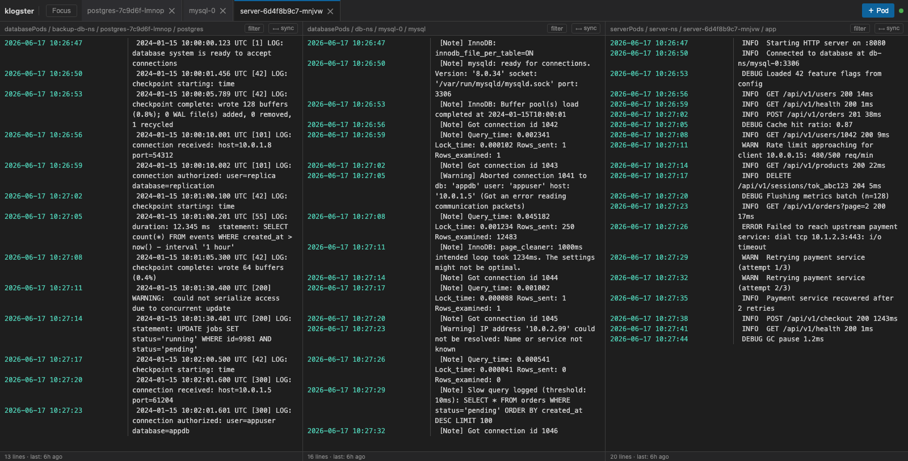

# klogster

klogster is a GUI app written in Go that streams logs from multiple sources —
Kubernetes pods selected by namespace and label, or local files — and displays them
side-by-side in a browser UI.



## Building and testing

```
make build      # compile the klogster binary
make test       # run Go and JavaScript tests
make test-go    # Go tests only
make test-js    # JavaScript tests only (requires Node.js ≥ 18)
```

## Command line

```
-logdir <dir>     directory to store logs (default: /tmp/klogster)
-cfg <file>       klogster config file (default: klogster.yaml)
-serve <ip:port>  address to serve the UI (default: :7070)
-demo             run with sample data instead of connecting to Kubernetes
```

## Config file

```yaml
- name: serverPods
  k8s:
    selectors:
      - namespace: server-ns
        labels:
          app: server

- name: databasePods
  k8s:
    selectors:
      - namespace: db-ns
        labels:
          app: mysql
      - namespace: backup-db-ns
        labels:
          app: postgres

- name: mixedPods
  k8s:
    selectors:
      - namespace: app-ns
        labels:
          app: worker
        containers:        # optional: stream only these containers
          - app
          - sidecar

- name: localFile
  file:
    path: /var/log/myapp/myapp.log
```

Each log group must have exactly one source — `k8s` or `file`.

For `k8s` groups, `containers` is optional. When omitted, klogster streams all
containers in each matching pod. Each container is tracked as a separate log source.

For `file` groups, klogster tails the file at the given path and shows it as a
single stream. No kubeconfig is needed if all groups use `file`.

## Functionality

**Kubernetes sources** connect to the cluster in the standard kubeconfig. Logs are
streamed from matching pods. The kubeconfig is only loaded when at least one `k8s`
group is configured.

**File sources** tail a local file, polling for new content every 250 ms. No
kubeconfig is required.

All log lines are saved to `-logdir` and kept in memory:

```
# Kubernetes pod/container
<logdir>/<group>/<namespace>:<pod>:<container>

# Local file
<logdir>/<group>/local:<filename>:tail
```

The last 10,000 lines per source are kept in memory for fast serving; the full
stream is appended to disk.

## Demo mode

Run without a Kubernetes cluster to explore the UI with sample data:

```
go run ./cmd --demo
```

This starts the server with two pre-populated log groups (`serverPods`, `databasePods`)
containing realistic timestamped log lines. No kubeconfig or config file is required.

## Log formats

klogster auto-detects the log format of each container's output stream by
sampling the first few lines. Once detected, the format is locked in for the
lifetime of that stream. Supported formats:

| Format | Detection | Example line |
|--------|-----------|--------------|
| **klog** | `[IWEF]MMDD HH:MM:SS.usec threadid file:line]` | `I0116 10:00:00.000000 1234 server.go:42] server started` |
| **slog text** | starts with `time=`, contains `level=` and `msg=` | `time=2024-01-16T10:00:00Z level=INFO msg="hello" port=8080` |
| **slog JSON** | starts with `{`, contains `"level":` and `"msg":` | `{"time":"2024-01-16T10:00:00Z","level":"INFO","msg":"hello"}` |
| **std log** | `YYYY/MM/DD HH:MM:SS` prefix | `2024/01/16 10:00:00 server started` |
| **unstructured** | fallback for any other text | `INFO server started on :8080` |

To add a new format, implement the `logformat.Format` interface in a new file
under `internal/logformat/` and call `logformat.Register` from an `init`
function. No other files need to change.

### Log line display

The timestamp should be separated on its own column on the side to make it
easier to read.

```
2026-01-01 00:11:22.123 | Log message...
2026-01-01 00:11:23.123 | Long log message that wrapped
                        | with more text
2026-01-01 00:11:24.123 | More logs...   
```

For logging formats that are structured fields should be display like this:

```
2026-01-01 00:11:22.123 | Message string.
                        | key1: value1
                        | key2: value2
```

## UI

The UI works like a multi-pane editor (VS Code style).

**Panel columns** are the vertical split panes. Each column holds one or more
tabs. Only the active tab's log is visible in its column; all other tabs
continue streaming in the background and become visible when clicked.

**Opening logs:**
* Click **＋ Log** to open the log browser. Clicking a log source opens it as
  a new tab in the currently focused column. If no columns are open, one is
  created automatically.
* Click **＋ Panel** to add a new empty column. The new column becomes the
  focus target, so the next log source you click opens there.

**Tabs:**
* Click a tab to switch to it within its column.
* Drag a tab to reorder it within its column, or drop it onto another
  column's tab bar to move it there.
* Close a tab with **✕**. When the last tab in a column is closed, the column
  is removed.

**Merged view:**
* Click **⊕** (right side of the tab bar) to combine all tabs in a column into a
  single, timestamp-sorted log stream. Each line is labeled with its source
  pod/container. Per-tab filters remain active in merged view.
* Click **⊕** again (or click any tab) to return to the normal single-tab view.

**State persistence:** the URL hash encodes the full layout — which pods are
open, which column they're in, the active tab per column, per-tab filters, and
focus state. Copy or bookmark the URL to restore the exact view on reload.

### Pause / Resume

The **⏸** button (top-right) pauses log updates to all panels.
While paused, the button turns amber and shows ▶; hovering shows the count of
buffered lines. Clicking ▶ flushes the buffer and resumes live updates — no messages are dropped.

### Per-panel filters

Each tab has a **filter** button in its toolbar. Filters are per-tab
include/exclude rules using regular expressions:
* **+ show**: hide all lines that do *not* match this pattern.
* **− hide**: hide all lines that *do* match this pattern.

Multiple filters are ANDed together.

### Focus dialog

The **Focus** button filters all visible panels simultaneously.
Lines matching any active focus pattern are shown and the matching text is
highlighted. A useful example: add a trace UUID to see every panel that
mentions it, with surrounding context.

Focus options:

* **Patterns**: one or more regexps (OR logic — a line is shown if it matches
  any pattern). Each pattern is listed and can be removed individually.
* **Context**: like `grep -C3` — also show lines near each match.
  * Line-based: number of surrounding lines to include.
  * Time-based: show lines within N seconds of each match.
  * Direction: before, around (default), or after each match.

### Timeline crosshair

Hover over a timestamp in any panel to see a crosshair drawn across all other
panels at the equivalent point in time. Timestamps that fall outside the
current viewport are shown as edge markers.
